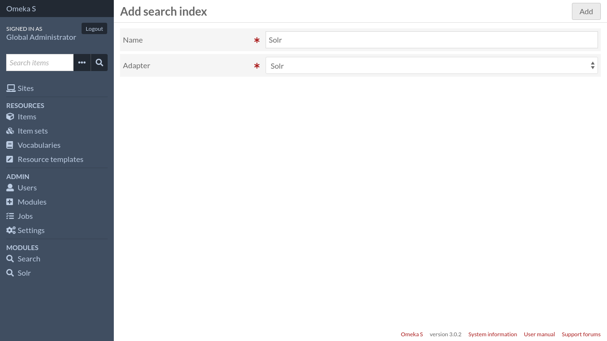

Search indexes
==============

Search indexes are repositories where Omeka resources will be stored in a
format suitable doing fast search queries. This repository will be updated
every time an Omeka resource is created, modified, or deleted, so the search
index will always be in sync with the data present in Omeka.

Create a search index
---------------------

To create a search index, go to the Search module's main configuration page.

Then click on the "Add new index" button in the upper right corner.

Give the search index a name, and select a search adapter. If you don't have
any available adapters, you need to install additional modules first, for
instance `Solr <https://github.com/biblibre/omeka-s-module-Solr>`_.

To continue, click on the "Add" button. This will create the search index, and
redirect you to the search index configuration page.

Choose if you want to index items, item sets, or both. If you choose to index
both, then both types of resources will be displayed in the search results.
There could be also settings specific to the adapter you selected in the
previous screen.

Once all settings are set, click on the "Save configuration" button. You will
be redirected back to the main configuration page.

Rebuild a search index
----------------------

When a search index is created, it is empty. If you already have created
resources, you have to manually rebuild the index in order to index all
existing resources. You will also need to rebuild the index if you change
something in the adapter settings and want the changes to apply immediately.

To rebuild the index, go to the Search module's main configuration page, find
the search index you want to rebuild and click on the |sync icon| sync icon on
the corresponding row.

You have the following options:

Clear index
   If you want to empty the index completely before rebuilding it, check that
   box.

Batch size
   This setting lets you change the number of resources that will be indexed at
   once. In general, indexing large batchs is faster, but uses more memory. If
   you're not sure, keep the default value.

To start the rebuilding process, click on the "Start index rebuild" button. The
process will be started in a background job and you will be redirected back to
the module's main configuration page.

Now that you have a search index, you can create a :doc:`search page
<search-pages>`.

Delete a search index
---------------------

To delete a search index, go to the Search module's main configuration page,
find the search index you want to delete and click on the |trash icon| trash
icon on the corresponding row. A drawer will appear on the right of the screen.

Click on the "Confirm delete" button to delete the search index.

.. note::

   This will not delete the actual data owned by the search engine. Only the
   search index configuration in Omeka will be deleted.

